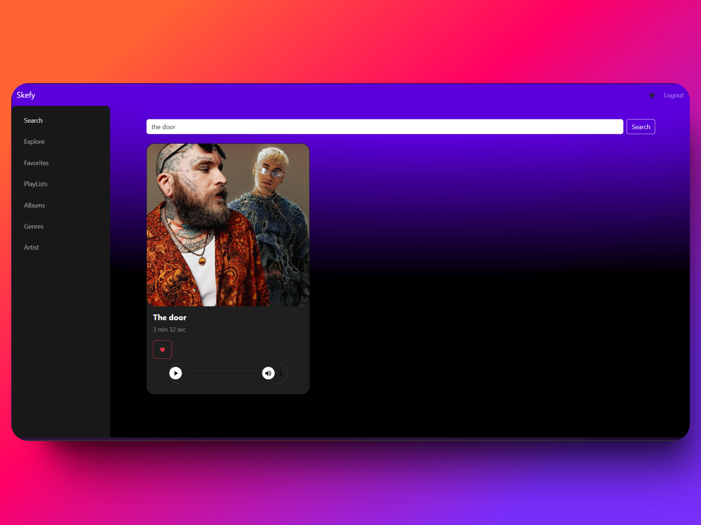

# Aplicacion  de Música con React

## **Documentación Técnica**

### **Introducción del Proyecto**
- **Breve descripción de la aplicación:**
    Esta aplicación permite a los usuarios explorar, reproducir y gestionar su música favorita. Los usuarios pueden buscar canciones, añadirlas a sus favoritos y reproducirlas directamente desde la aplicación. Asi mismo tambien pueden gestionar las listas de reproducciones, albunes, artistas y generos.

- **Propósito y objetivos del proyecto:**
    El objetivo del proyecto es proporcionar una plataforma intuitiva y fácil de usar para la gestión y reproducción de música. La aplicación está diseñada para ser rápida, responsiva y accesible desde cualquier dispositivo.

### **Guía de Instalación**
- **Requisitos previos**
  - Node.js (versión 14 o superior)
  - npm (versión 6 o superior)
  - React (versión 17 o superior)
  - Bootstrap (versión 5 o superior)

###  **Instrucciones de instalación**
 1. Clona el repositorio:
     ```bash
     git clone https://github.com/kevinserrano01/proyecto_final_react.git
     cd proyecto_final_react
     ```
  2. Instala las dependencias:
     ```bash
     npm install
     ```
  3. Inicia la aplicación:
     ```bash
     npm run dev
     ```

### **Configuración del entorno**
Variebale de entorno: 
[`.env`](app-music-react/.env")
  ```env
  API_URL = http://api.com
  ```

### **Estructura de archivos y carpetas**
    ├── public
    ├── src
    │   ├── assets
    │   ├── components
    │   │   ├── Albums
    │   │   ├── Artist
    │   │   ├── Auth
    │   │   ├── Genres
    │   │   ├── Layout
    │   │   ├── Music
    │   │   ├── PlayList
    │   │   ├── Search
    │   │   ├── NotFound.jsx
    │   ├── contexts
    │   │   ├── AuthContext.jsx
    │   │   ├── FavoritesContext.jsx
    │   │   ├── PageContext.jsx
    │   ├── hooks
    │   │   ├── secondToMinute.js
    │   │   ├── useFetchHook.js
    │   │   ├── useForm.js
    │   ├── routes
    │   │   ├── Albums.jsx
    │   │   ├── Artist.jsx
    │   │   ├── Favorites.jsx
    │   │   ├── Genres.jsx
    │   │   ├── Music.jsx
    │   │   ├── PlayList.jsx
    │   ├── security
    │   │   ├── ProtectedRoute.jsx
    │   ├── main.jsx
    │   ├── Router.jsx
    │   ├── Layout.jsx
    ├── .env
    ├── package.json
    ├── README.md
    └── index.html


### **Descripción de los módulos**
- **components**: Contiene los componentes reutilizables de la aplicación.
- **contexts**: Contiene los contextos de React para la gestión del estado global.
- **hooks**: Contiene hooks personalizados utilizados en la aplicación.

### **Guía de Uso:**
- **Ejemplos de uso:** 
    1. Para explorar una canción, haz clic en el título de la canción en la tarjeta.
    2. Para añadir una canción a tus favoritos, haz clic en el botón de corazón.
    3. Para reproducir una canción, utiliza el reproductor de audio en la tarjeta de la canción.

### **Capturas de pantalla**



### **Flujos de trabajo:**
    1. Explorar canciones: Los usuarios pueden navegar por la lista de canciones disponibles.
    2. Añadir a favoritos: Los usuarios pueden marcar canciones como favoritas para un acceso rápido.
    3. Reproducir canciones: Los usuarios pueden reproducir canciones directamente desde la aplicación.

### **Mantenimiento y Actualización:**
#### Convenciones de código:
- Utiliza ESLint para mantener un estilo de código consistente.
- Sigue las convenciones de nomenclatura de React para componentes y archivos.


### **Documentación de Usuario Final**
#### Manual del Usuario:

    1. Abre la aplicación en tu navegador.
    2. Navega por la lista de canciones disponibles.
    3. Haz clic en una canción para reproducirla o añadirla a tus favoritos.
#### Descripción de funcionalidades:
    - Explorar canciones: Permite a los usuarios buscar y explorar canciones.
    - Añadir a favoritos: Permite a los usuarios marcar canciones como favoritas.
    - Reproducir canciones: Permite a los usuarios reproducir canciones directamente desde la aplicación.
    - Crear canciones: Permite subir canciones.
    - Editar canciones: Permite editar los datos de las canciones.
    - Eliminar canciones: Permite eliminar canciones.

#### Preguntas Frecuentes (FAQs):
    - ¿Cómo añado una canción a mis favoritos? Haz clic en el botón de corazón en la tarjeta de la canción.
    - ¿Cómo reproduzco una canción? Utiliza el reproductor de audio en la tarjeta de la canción.
